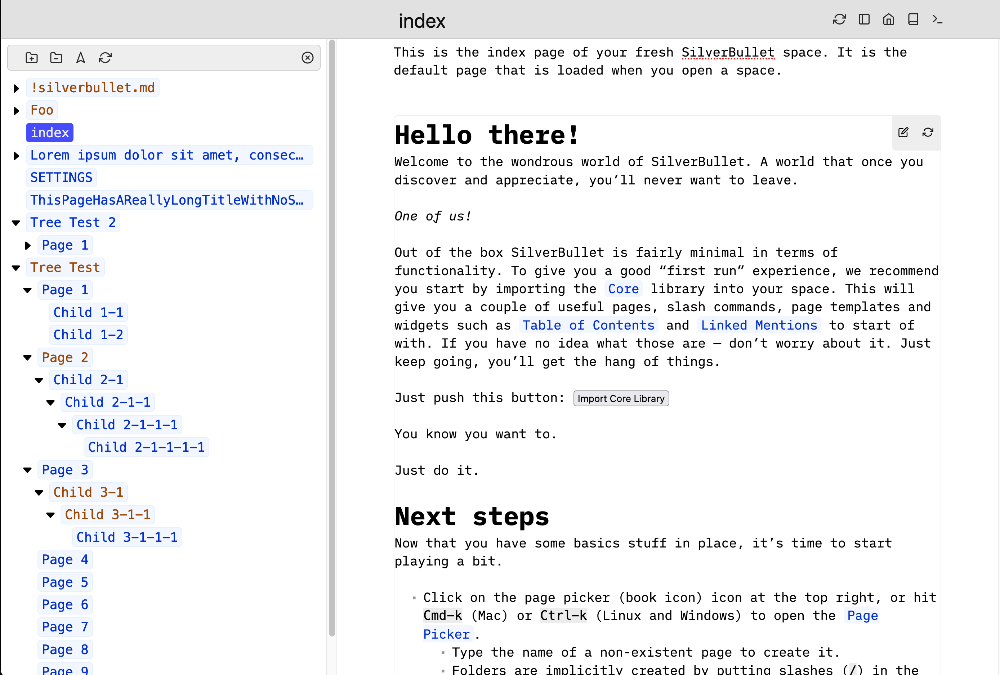
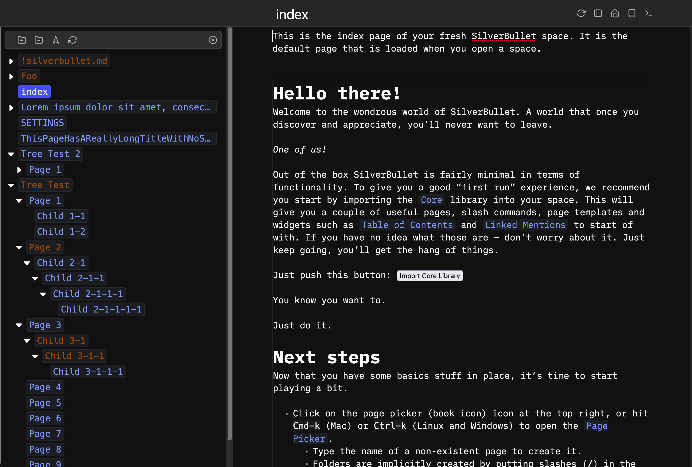

# SilverBullet TreeView plug

A unified navigation panel for **SilverBullet v2** with two view modes:

- **Tag Tree View** — a hierarchical, tag-based tree for navigating pages by tag.
- **Outline View** — all headers in the current page for quick in-page navigation.

Switch between modes with the view-switcher buttons in the panel header.

<a href="screenshot.png"></a>
<a href="screenshot-dark.png"></a>

## Installation

This plug is distributed as a SilverBullet v2 [Library](https://silverbullet.md/Library).
Run the **`Library: Install`** command (Configuration Manager → Libraries) and enter:

```
https://github.com/josh-j/silverbullet-tagview/blob/main/PLUG.md
```

It installs as `Library/josh-j/silverbullet-tagview/PLUG` plus `treeview.plug.js`.
If the commands don't appear right away, run **`Plugs: Reload`**. To get later
updates, use **`Library: Update`**.

> SilverBullet v1 (the old `Plugs: Add` / `SETTINGS` / `_plug` flow) is **not**
> supported by this version.

## Commands

| Command | Default key | Description |
|---------|-------------|-------------|
| `Tag Tree: Toggle` | `Ctrl/Cmd-Alt-B` | Show/hide the panel in Tag Tree mode |
| `Outline: Toggle` | `Ctrl/Cmd-Alt-O` | Show/hide the panel in Outline mode |
| `Tag Tree: Rename Tag` | — | Rename a tag (and its children) everywhere it's used |
| `Tag Tree: Version` | — | Show the installed plug version |

## Renaming tags

`Tag Tree: Rename Tag` — or the ✎ button in the panel header (Tags view) — renames
a tag across your whole space. Click a tag in the panel (it's highlighted to show
it's the rename target) then press ✎, or run the command and pick from the list.
Enter the new name, and confirm
(it reports how many files are affected). It rewrites both inline `#hashtags` and
frontmatter `tags:` entries, and renames **hierarchical children** too: renaming
`econ` → `economics` turns `#econ` into `#economics` *and* `#econ/us` into
`#economics/us`, while leaving unrelated tags such as `#economy` untouched. The
currently open page is edited in place; other pages are rewritten on disk and the
index is refreshed automatically.

## Configuration

All settings are **optional**. The plug reads them from a `treeview` key on your
`CONFIG` page (you can also set them from a [Space Lua](https://silverbullet.md/Space%20Lua)
block via `config.set("treeview", { ... })`). Defaults are shown below.

```yaml
treeview:
  # Where the panel docks. One of: lhs | rhs | bhs | modal
  #   lhs   - left-hand side (default)
  #   rhs   - right-hand side
  #   bhs   - bottom
  #   modal - floating modal overlay
  position: lhs

  # Panel size as a CSS flex factor (must be a number > 0). Larger values make
  # the panel bigger relative to the editor. Default: 1
  size: 1
```

| Key | Type | Default | Notes |
|-----|------|---------|-------|
| `position` | `"lhs"` \| `"rhs"` \| `"bhs"` \| `"modal"` | `"lhs"` | Where the panel docks |
| `size` | number > 0 | `1` | Panel flex size relative to the editor |

Invalid values are ignored (the default is used) and the plug flashes a
notification naming the offending key — so if a setting doesn't seem to apply,
check the notification.

## Build

This plug targets SilverBullet v2 and builds with Node/npm using the
`plug-compile` bin from the `@silverbulletmd/silverbullet` package.

```shell
npm install      # first time
npm run build    # produces treeview.plug.js
npm run watch    # rebuild on change
npm run debug    # unminified build with per-function size info
```

To test a local build, copy `treeview.plug.js` into your space (any folder) and
run **`Plugs: Reload`** — SilverBullet v2 loads any `*.plug.js` in the space.

> **Maintainer note:** SilverBullet's `Library: Update` detects new versions from
> changes to `PLUG.md` content, **not** from the `.plug.js` binary. Bump the
> `version:` field in `PLUG.md` (and `PLUG_VERSION` in `config.ts`) whenever you
> ship a new build, or clients won't see the update.

## Development

### `SortableTree`

The tree component is Marc Anton Dahmen's
[SortableTree](https://marcantondahmen.github.io/sortable-tree)
([GitHub repo](https://github.com/marcantondahmen/sortable-tree)).

Latest build files (replace them in `assets/sortable-tree` to upgrade):

- https://unpkg.com/sortable-tree/dist/sortable-tree.js
- https://unpkg.com/sortable-tree/dist/sortable-tree.css
